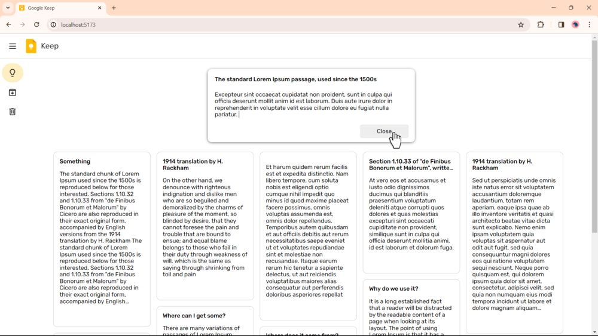
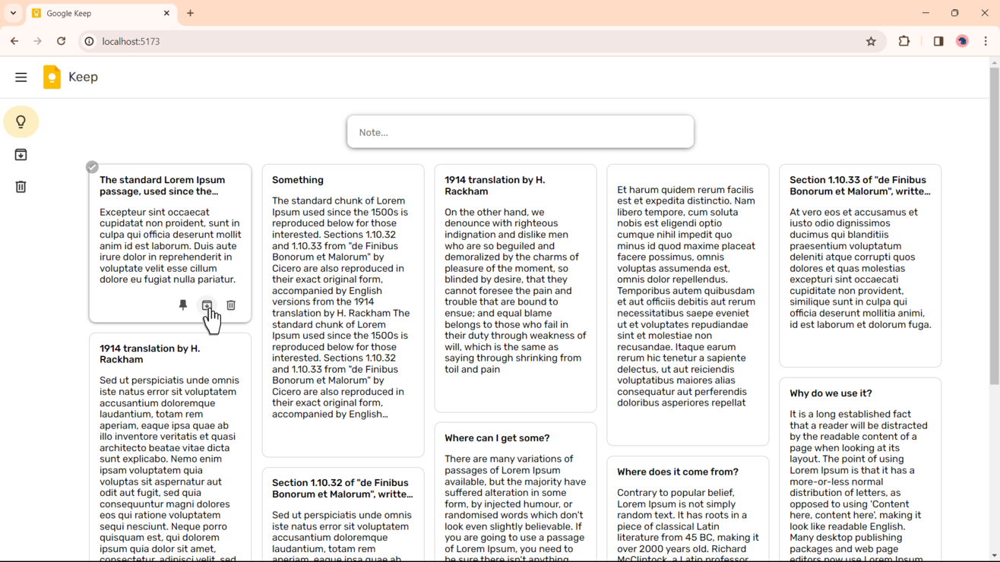
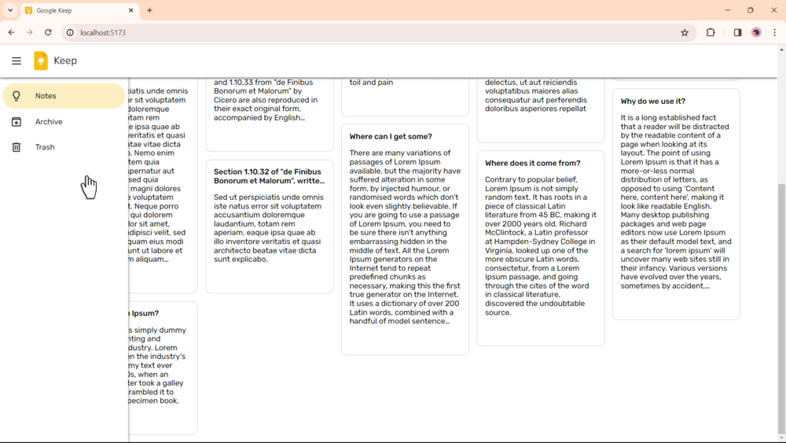

# Google Keep

Hi! This project is a **_Keep_** clone inspired by my favorite **Google** app.

## Description

The project is a note-taking platform consisting of three main pages: Home, Archive and Trash. You can create notes and archive or delete them, as hinted at in the titles of the respective pages.

At the moment this is the main functionality of the project. I emphasize “for now” because my goal is to devote as much time as I feel inspired to this project. But besides this, there are other improvements that make using the application even more enjoyable.

The original of this site is my daily tool and it feels good to create something like this in an effort to improve and add more features.

## Links

- [Live Site URL]()

## Technologies Used

- **HTML+CSS**: Basic markup and styling languages that form the foundation of the visual representation of the application.

- **JavaScript**: The primary programming language that adds interactivity and dynamism to the entire project.

- **ReactJS**: A JavaScript library used to build user interfaces. Its component-based approach allows efficient state management.

- **React Router Dom**: A library for navigation in React applications, providing convenient routing between pages.

- **Redux**: A state management library useful for handling the state of large and complex applications.

- **Redux Toolkit**: A simplified and optimized set of tools for working with Redux, making the development process more efficient.

- **SASS**: A CSS preprocessor extension, providing additional capabilities such as variables and nested styles.

- **React-responsive-masonry**: A library for creating responsive grids, ensuring a beautiful and modern design.

## Screenshots

  
  
  

